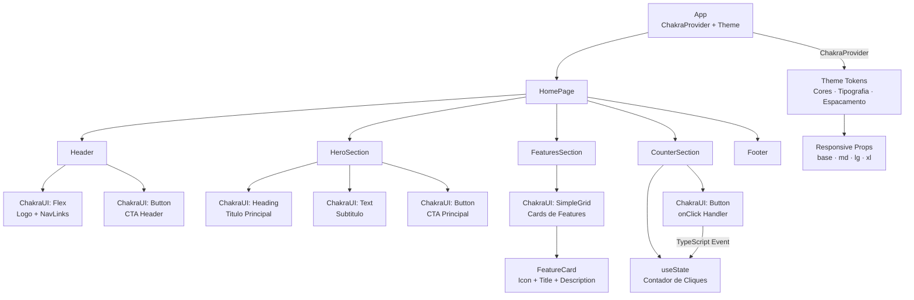
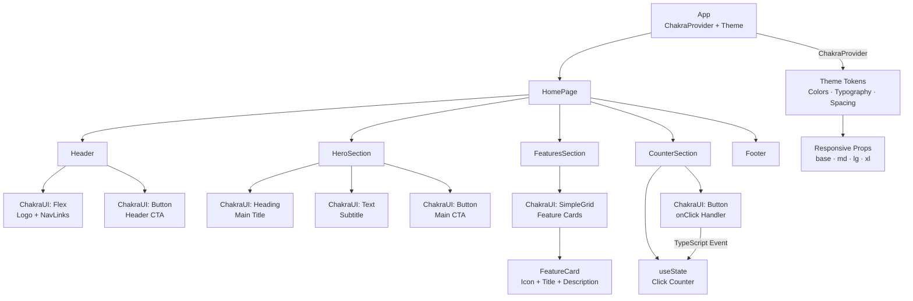

# Criando uma Homepage com React

<div align="center">


</div>

---

## Portugues

Este projeto e parte de um desafio pratico da DIO, com o objetivo de criar componentes da pagina inicial utilizando **React**, **Chakra UI** e **TypeScript**, alem de aplicar eventos e estilizacao moderna.

## Funcionalidades

- Componentes estilizados com Chakra UI
- Botao com contador e evento de clique
- Tipagem estatica com TypeScript
- Layout limpo e responsivo

## Tecnologias

- React
- TypeScript
- Chakra UI
- Vite

## Arquitetura de Componentes React / Chakra UI



## Como executar

```bash
# Clone o repositorio
git clone https://github.com/galafis/-Criando-uma-Homepage-com-React.git

# Instale as dependencias
npm install

# Rode o projeto
npm run dev
```

Acesse `http://localhost:5173` no navegador.

## Descricao

Este repositorio contem o codigo-fonte de uma homepage criada com React, TypeScript e Chakra UI. O projeto demonstra a criacao de componentes tipados, o uso do sistema de design tokens do Chakra UI para estilizacao consistente e responsiva, e a aplicacao de eventos React com TypeScript para interatividade.

## Instalacao

1. **Clone o repositorio:**
   ```bash
   git clone https://github.com/galafis/-Criando-uma-Homepage-com-React.git
   ```
2. **Navegue ate o diretorio do projeto:**
   ```bash
   cd -Criando-uma-Homepage-com-React
   ```
3. **Instale as dependencias:**
   ```bash
   npm install
   ```

## Uso

```bash
npm run dev
```

Abra `http://localhost:5173` no navegador para visualizar a homepage. Clique no botao contador para ver os eventos React com TypeScript em acao.

## Baseado em

[https://github.com/digitalinnovationone/desafio02-ts](https://github.com/digitalinnovationone/desafio02-ts)

## Licenca

Este projeto esta licenciado sob a Licenca MIT. Consulte o arquivo `LICENSE` para mais detalhes.

---

## English

This project is part of a DIO practical challenge, with the goal of creating homepage components using **React**, **Chakra UI**, and **TypeScript**, as well as applying events and modern styling.

## Features

- Components styled with Chakra UI
- Button with counter and click event
- Static typing with TypeScript
- Clean and responsive layout

## Technologies

- React
- TypeScript
- Chakra UI
- Vite

## React / Chakra UI Component Architecture



## How to Run

```bash
# Clone the repository
git clone https://github.com/galafis/-Criando-uma-Homepage-com-React.git

# Install dependencies
npm install

# Start the project
npm run dev
```

Access `http://localhost:5173` in your browser.

## Description

This repository contains the source code for a homepage created with React, TypeScript and Chakra UI. The project demonstrates the creation of typed components, the use of Chakra UI's design token system for consistent and responsive styling, and the application of React events with TypeScript for interactivity.

## Installation

1. **Clone the repository:**
   ```bash
   git clone https://github.com/galafis/-Criando-uma-Homepage-com-React.git
   ```
2. **Navigate to the project directory:**
   ```bash
   cd -Criando-uma-Homepage-com-React
   ```
3. **Install dependencies:**
   ```bash
   npm install
   ```

## Usage

```bash
npm run dev
```

Open `http://localhost:5173` in your browser to view the homepage. Click the counter button to see React events with TypeScript in action.

## Based On

[https://github.com/digitalinnovationone/desafio02-ts](https://github.com/digitalinnovationone/desafio02-ts)

## License

This project is licensed under the MIT License. See the `LICENSE` file for more details.

---

**Author:** Gabriel Demetrios Lafis
